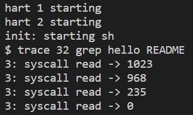
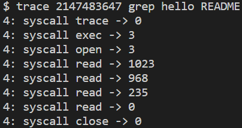
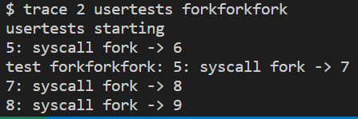
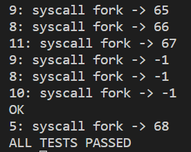
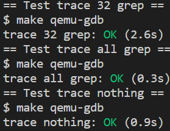
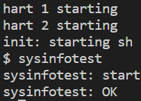
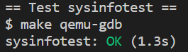

# Lab 2 system calls

## 实验目的
本实验的目的是在 xv6 操作系统中添加两个新的系统调用：``System call tracing`` 和 ``Sysinfo`` 。通过这两个实验，旨在加深对操作系统的理解，了解系统调用的实现和内核的一些内部机制。

## System call tracing (moderate)
### 实验目的
本实验的目标是添加一项系统调用跟踪功能，该功能可以在后续实验中进行调试。需要创建一个新的跟踪系统调用（``trace system call``），用于控制跟踪操作。该系统调用应接受一个整数参数 "``mask``"，其中的位指定要跟踪的系统调用。例如，要跟踪 fork 系统调用，程序应调用 ``trace(1 << SYS_fork)``，其中 ``SYS_fork`` 是来自 ``kernel/syscall.h`` 的系统调用号。需要修改 ``xv6`` 内核以便在每个系统调用即将返回时打印一行输出，但仅当该系统调用的编号在 ``mask`` 中设置时才打印。输出行应包含进程ID、系统调用名称和返回值；不需要打印系统调用的参数。``trace`` 系统调用应启用调用它的进程以及其后续 ``fork`` 出的所有子进程的跟踪，但不应影响其他进程。

### 实验步骤
1. 阅读文档和源代码：仔细阅读 xv6 书籍的第2章和第4章的4.3节和4.4节，并查看相关的源代码文件。

2. 切换到 ``syscall`` 分支：使用 ``git`` 命令切换到 ``syscall`` 分支，并执行 ``make clean`` 命令进行清理。

3. 添加系统调用和存根：根据实验要求，在相关文件中添加系统调用的声明和存根，确保 ``make grade`` 命令能够正确执行。例如，在 ``user/usys.pl`` 中添加 ``trace`` 的入口，并在 ``kernel/syscall.h`` 中定义 ``SYS_trace`` 的系统调用号。
```
// user/usys.pl
entry("trace");

// kernel/syscall.h
#define SYS_trace  22

```

4. 实现系统调用跟踪：根据实验要求，在 xv6 内核中添加一个新的系统调用 ``trace``。该系统调用接受一个整数参数 ``mask``，用于指定要跟踪的系统调用。修改 ``syscall()`` 函数，在系统调用返回前打印相应的跟踪信息。以下是代码部分：
```
// kernel/syscall.c
// 此函数负责处理系统调用。
void syscall(void)
{
  int num;
  struct proc *p = myproc();

  // 从当前进程的陷阱帧中获取系统调用号
  num = p->trapframe->a7;

  // 检查系统调用号是否有效并在定义的系统调用范围内
  if (num > 0 && num < NELEM(syscalls) && syscalls[num])
  {
    // 调用相应的系统调用函数，并将返回值存储在陷阱帧的a0寄存器中
    p->trapframe->a0 = syscallsnum;

    // 获取当前进程的屏蔽位图
    int mask = p->mask;

    // 检查系统调用是否被屏蔽（启用）
    if ((1 << num) & mask)
    {
      // 打印跟踪消息，指示执行的系统调用及其返回值
      printf("%d: syscall %s -> %d\n", p->pid, syscall_names[num], p->trapframe->a0);
    }
  }
  else
  {
    // 打印错误消息，指示未知的系统调用
    printf("%d %s: unknown sys call %d\n",
           p->pid, p->name, num);

    // 将陷阱帧的a0寄存器中的返回值设置为-1
    p->trapframe->a0 = -1;
  }
}
```

5. 运行并测试：使用提供的 ``trace`` 程序运行其他程序，并验证输出是否符合预期。
- 


- 

-  (中间省略部分) 

- make grade评分



### 实验中遇到的问题和解决办法
- 问题：系统调用跟踪的输出与预期不符。
- 解决办法：检查代码中的跟踪输出部分，确保正确获取并打印所需的信息。确保在每个系统调用返回之前进行跟踪输出，检查系统调用的返回值。

### 实验心得
在完成 ``System call tracing`` 实验后，我对系统调用的执行流程和内核的一些内部机制有了更深入的了解。通过实验，我学会了如何在 xv6 内核中添加新的系统调用，并实现了系统调用跟踪功能。

在实验过程中，我遇到了一些挑战和问题。最初，系统调用跟踪的输出与预期不符。通过仔细检查代码并逐步调试，我发现问题出在正确获取并打印所需的跟踪信息上。在每个系统调用返回之前进行跟踪输出，并确保正确处理系统调用的返回值。通过解决这些问题，我提高了自己的代码调试和问题解决能力。

通过完成实验，我更深入地理解了操作系统的系统调用机制。我了解了用户空间和内核空间之间的交互方式，并学会了如何在用户程序中调用新添加的系统调用。此外，我还加深了对 xv6 内核的理解，包括系统调用的执行流程、内核数据结构和进程管理。

## Sysinfo (moderate)
### 实验目的
本实验旨在添加一个系统调用``sysinfo``，用于收集有关正在运行的系统的信息。该系统调用接受一个参数：指向``struct sysinfo``结构体的指针（见``kernel/sysinfo.h``）。内核应填充该结构体的字段：``freemem``字段应设置为空闲内存的字节数，``nproc``字段应设置为状态不是``UNUSED``的进程数量。提供了一个名为``sysinfotest``的测试程序；如果该程序打印出``"sysinfotest: OK"``，则表示通过此任务。

### 实验步骤
1. 添加系统调用和存根：根据实验要求，在相关文件中添加系统调用的声明和存根，确保编译和链接过程能够正确执行。例如，在 ``user/usys.pl`` 中添加 ``sysinfo`` 的入口，并在 ``kernel/syscall.h`` 中定义 ``SYS_sysinfo`` 的系统调用号。
```
// user/usys.pl
entry("sysinfo");

// kernel/syscall.h
#define SYS_sysinfo  23

```

2. 编写测试程序：编写 ``sysinfotest`` 程序，该程序用于测试 ``sysinfo`` 系统调用的功能，确保输出为 "``sysinfotest: OK``"。以下是代码部分：
```
// user/sysinfotest.c
#include "kernel/types.h"
#include "kernel/stat.h"
#include "user/user.h"
#include "kernel/sysinfo.h"

int
main(int argc, char *argv[])
{
  struct sysinfo info;
  if (sysinfo(&info) < 0) {
    printf("sysinfotest: Failed\n");
    exit(1);
  }

  printf("sysinfotest: OK\n");
  exit(0);
}

```

3. 实现 ``sysinfo`` 系统调用：根据实验要求，在 xv6 内核中添加一个新的系统调用 ``sysinfo``。该系统调用接受一个指向 ``struct sysinfo`` 的指针作为参数，并将系统的空闲内存和进程数量填充到该结构体中。以下是代码部分：
```
// kernel/sysproc.c
uint64 sys_sysinfo(void)
{
  uint64 addr;
  if (argaddr(0, &addr) < 0)
    return -1;

  struct sysinfo info;
  info.freemem = getfreemem();
  info.nproc = getnproc();

  struct proc *p = myproc();
  if (copyout(p->pagetable, addr, (char *)&info, sizeof(info)) < 0)
    return -1;

  return 0;
}

```

4. 复制数据到用户空间：根据实验要求，在内核中实现相应的函数，用于收集空闲内存的数量和进程的数量，并使用 ``copyout()`` 函数将数据正确地复制到用户空间。以下是代码部分：
```
// kernel/kalloc.c
uint64 getfreemem(void)
{
  uint64 freemem = 0;
  acquire(&kmem.lock);
  struct run *r = kmem.freelist;
  while (r) {
    freemem += PGSIZE;
    r = r->next;
  }
  release(&kmem.lock);
  return freemem;
}

// kernel/proc.c
uint64 getnproc(void)
{
  struct proc *p;
  uint64 nproc = 0;
  for (p=proc; p<&proc[NPROC]; p++) {
    if (p->state != UNUSED)
      ++nproc;
  }
  return nproc;
}

```

5. 测试评分
- 运行 ``sysinfotest``：运行 ``sysinfotest`` 程序，并确保输出为 "``sysinfotest: OK``"。



- ``make grade``评分



### 实验中遇到的问题和解决办法
- 问题：``sysinfotest`` 程序无法编译或输出不正确。
- 解决办法：检查代码中的编译错误并修复。确保正确实现 ``sysinfo`` 系统调用，并在该系统调用中正确填充 ``struct sysinfo`` 的字段。使用 ``copyout()`` 函数将数据正确地复制到用户空间。

### 实验心得
完成 ``Sysinfo`` 实验后，我对系统调用的实现和内核的一些内部机制有了更深入的认识。通过实验，我学会了在 xv6 内核中添加新的系统调用，并实现了收集系统信息的功能。

在实验过程中，我遇到了一些挑战和问题。最初，``sysinfotest`` 程序无法编译或输出结果不正确。通过仔细检查代码和编译错误，并确保正确实现了 ``sysinfo`` 系统调用，我解决了这些问题。同时，我学会了如何使用 ``copyout()`` 函数将数据正确地从内核空间复制到用户空间。

通过实验，我深入了解了系统调用的实现原理和内核的一些内部机制。我学到了如何使用结构体传递参数并将数据从内核复制到用户空间。此外，我还了解了内核中管理空闲内存和进程的方式，加深了对 xv6 内核的理解。

总的来说，这两个实验让我更深入地了解了操作系统的工作原理和内核的一些内部机制。通过实际编写和调试代码，我不仅加深了对系统调用和内核的理解，还提高了自己的实际操作能力。这些实验为我今后在操作系统领域的学习和工作打下了坚实的基础。通过实验，我不仅加深了对操作系统的理解，还提升了自己的实际操作能力。


# 评分
```
== Test trace 32 grep == 
$ make qemu-gdb
trace 32 grep: OK (2.6s) 
== Test trace all grep == 
$ make qemu-gdb
trace all grep: OK (0.3s) 
== Test trace nothing == 
$ make qemu-gdb
trace nothing: OK (0.9s) 
== Test trace children == 
$ make qemu-gdb
trace children: OK (10.6s) 
== Test sysinfotest == 
$ make qemu-gdb
sysinfotest: OK (1.3s) 
== Test time == 
time: OK 
Score: 35/35
```