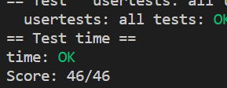

# Lab 3 page tables

## 实验目的
本实验的目的在于熟悉 xv6 的多级页表的工作原理和优化 kernel 与 user 交互机制。

## System call tracing (easy)
### 实验目的
在本实验中，我们将探索页表并对其进行修改，以加快某些系统调用，并检测哪些页已被访问。具体而言，我们将实现一个用于加速系统调用的优化，并为某些用户进程添加一个只读共享页，用于存储特定信息。

### 实验步骤
1. 在用户进程被创建时，在 ``USYSCALL`` 虚拟地址处映射一个只读的页，并在该页的起始处存储一个 ``struct usyscall`` 结构体，用于存储当前进程的 ``PID``。

2. 在 ``kernel/proc.h`` 中定义 ``struct usyscall`` 结构体，包含一个成员 ``pid``，用于存储进程的 ``PID``。

3. 在 ``kernel/proc.c`` 的 ``allocproc()`` 函数中为每个新创建的进程分配并初始化 ``usyscall`` 页面。

4. 在 ``kernel/proc.c`` 的 ``proc_pagetable()`` 函数中添加用户进程页表中共享页的映射。

### 实验中遇到的问题和解决办法
- 问题：未正确在用户页表中添加共享页的映射。
- 解决办法：在 ``proc_pagetable()`` 函数中使用 ``mappages()`` 函数添加共享页的映射，并设置相应的标记位。

### 实验心得
通过本次实验，我们深入了解了操作系统内核的内存管理和页表结构。实现加速系统调用的功能，加深了对虚拟内存的理解和对 ``RISC-V`` 特权架构的应用。同时，学会了如何在页表中插入 ``PTE``，以加速特定系统调用。该实验还锻炼了我们在 C 语言中处理数据结构和指针的能力。整体而言，这是一次非常有趣且具有挑战性的实验。

## Print a page table (easy)
### 实验目的
在本实验中，您将编写一个函数 ``vmprint()``，用于打印页表内容。该函数接受一个 ``pagetable_t`` 参数，并以一定的格式打印出该页表的内容。

### 实验步骤
1. 在 ``kernel/vm.c`` 中实现 ``vmprint()`` 函数。
2. 使用递归或迭代的方式遍历页表，并按照一定的格式打印出每个 ``PTE`` 的索引、``PTE`` 的 16 进制表示和从 ``PTE`` 中提取的物理地址。

### 实验心得
通过本次实验，我们深入了解了操作系统内核的页表结构，并学会了遍历页表并打印出其中的信息。实现 ``vmprint()`` 函数的过程中，我们对递归和迭代的应用有了更深入的了解，并加深了对页表中 ``PTE`` 格式和页表级数的理解。整体而言，这是一个非常简单但有趣的实验。

## Detecting which pages have been accessed (hard)
### 实验目的
在本实验中，您将为 ``xv6`` 添加一个新功能，该功能通过检查 ``RISC-V`` 页表中的访问位来检测并向用户空间报告此信息。我们将实现 ``pgaccess()`` 系统调用，该系统调用用于检测哪些页面已被访问。具体而言，系统调用需要三个参数：需要检查的用户页中第一个页的起始虚拟地址、需要检查的用户页的数目和用于存储结果的缓冲区的用户空间地址。

### 实验步骤
1. 在 ``kernel/syscall.c`` 中添加 ``sys_pgaccess()`` 系统调用外壳。
2. 获取系统调用参数，包括待检查的用户页起始虚拟地址、待检查的用户页数量和存储结果的缓冲区的用户空间地址。
3. 在 ``kernel/vm.c`` 中实现 ``pgaccess()`` 系统调用功能。
4. 遍历指定的用户页，检查 ``PTE_A`` 位，若为 1 则表示该页最近被访问过，将结果存储到一个位掩码中，并清除 ``PTE_A`` 位。
5. 将结果位掩码复制到用户空间缓冲区。

### 实验中遇到的问题和解决办法
- 问题：在实现 ``pgaccess()`` 系统调用功能时，未正确遍历用户页并检查 ``PTE_A`` 位。
- 解决办法：在实现 ``pgaccess()`` 系统调用功能时，未正确遍历用户页并检查 ``PTE_A`` 位。

### 实验心得
通过本次实验，我们学会了在 ``xv6`` 中添加新的系统调用，以及如何使用用户空间缓冲区和内核空间缓冲区之间的数据传输。实现 ``pgaccess()`` 系统调用的过程中，我们深入了解了 ``RISC-V`` 页表中的访问位 ``PTE_A``，并学会了如何在内核中清除这些位。此外，我们也对用户空间和内核空间之间的地址转换有了更深入的了解。整体而言，这是一个有挑战性的实验，但通过克服问题，我们收获了很多知识和经验。

# 评分

